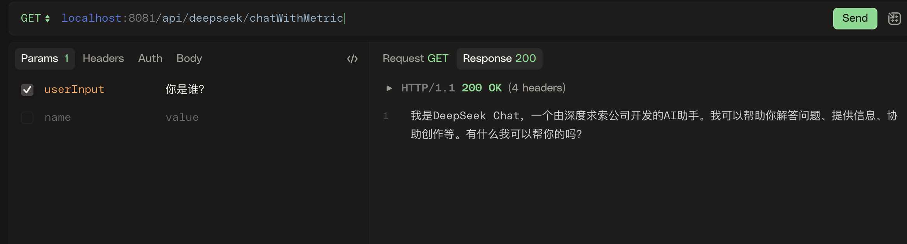

## Spring AI Summary


<p align="left">
  <a href="README.md" target="_blank"></a>
  <a href="README_EN.md" target="_blank"></a>
  <a href="https://github.com/java-ai-tech/spring-ai-summary/wiki" target="_blank"></a>
</p>


🚀🚀🚀 Spring AI Summary 是一个基于原生 Spring AI 开发的样例工程集合，旨在帮助开发者快速掌握 Spring AI 框架的核心功能和使用方法。通过模块化设计，每个模块专注于特定功能领域，提供清晰的代码示例和详细的文档，帮助开发者轻松上手并深入理解框架的核心概念。

### 项目特点

- **模块化设计**：每个模块聚焦于一个功能领域，例如聊天、RAG（检索增强生成）、文本向量化、工具函数调用、会话记忆管理等，方便开发者按需学习和应用。
- **实用示例**：每个模块都包含完整的示例代码和文档，展示 Spring AI 的实际应用场景，帮助开发者快速构建自己的 AI 应用。
- **持续更新**：紧跟 Spring AI 的最新动态和版本更新，及时优化示例代码和文档，确保内容始终与框架保持同步。
- **社区支持**：同步优质技术文章和实践经验，分享最佳实践，帮助开发者更好地理解和应用 Spring AI。

### 适合人群

Spring AI Summary 面向对 Spring AI 框架感兴趣的开发者，无论是初学者还是有经验的工程师，都可以通过本项目快速了解框架的核心功能，并将其应用到实际项目中。

通过 Spring AI Summary，您可以：

- 掌握 Spring AI 的核心概念和功能。
- 学习如何构建高效的 AI 应用。
- 获取最新的技术动态和实践经验。

欢迎您加入社区，共同探索 Spring AI 的无限可能 (因群二维码有过期时间限制，请加群主二维码邀请进群，备注 Spring AI)！

<p align="center">
  
</p>

## 🗂️ 项目结构

本工程采用模块化设计，按照功能特性主要划分为以下几个模块：

```
spring-ai-summary/
├── spring-ai-chat/                   # 聊天模块
│   ├── spring-ai-chat-openai/        # OpenAI 模型接入
│   ├── spring-ai-chat-qwen/          # 通义千问模型接入
│   ├── spring-ai-chat-doubao/        # 豆包模型接入
│   ├── spring-ai-chat-deepseek/      # DeepSeek 模型接入
│   ├── spring-ai-chat-multi/         # 多 chat 模型调用
│   │   spring-ai-chat-ollama/        # 接入 ollma
│   └── spring-ai-chat-multi-openai/  # 多 OpenAI 协议模型调用
├── spring-ai-rag/                    # RAG 检索增强生成
├── spring-ai-vector/                 # 文本向量化服务
    |── spring-ai-vector-milvus/      # Milvus 向量存储
    ├── spring-ai-vector-redis/       # redis 向量存储
├── spring-ai-tool-calling/           # 工具函数调用示例
├── spring-ai-chat-memory/            # 会话记忆管理
    ├── spring-ai-chat-memory-jdbc    # 基于 jdbc 实现存储
    ├── spring-ai-chat-memory-local   # 基于 内存 实现存储
├── spring-ai-evaluation/             # AI 回答评估
└── spring-ai-mcp/                    # MCP 示例
    ├── spring-ai-mcp-server          # MCP 服务器
    ├── spring-ai-mcp-client          # MCP 客户端
└── spring-ai-agent/                  # agent 示例
```

## 🚀 快速开始

### ⚙️ 环境要求

| 依赖项         | 版本/要求         | 说明                |
| -------------- | ---------------- | ------------------- |
| SpringBoot     | 3.3.6            |                     |
| Spring AI      | 1.0.0            |                     |
| JDK            | 21+              |                     |
| Maven          | 3.6+             |                     |
| Docker         | （用于运行 Milvus） |                     |

### 1. 🧬 克隆项目

```bash
# 克隆项目到本地
git clone https://github.com/java-ai-tech/spring-ai-summary.git
# 进入项目目录并且 compile 项目
cd spring-ai-summary && mvn clean compile -DskipTests
```

> 如果遇到 Maven 依赖下载慢的问题，可以尝试使用国内的 Maven 镜像源，如阿里云、清华大学等；运行过程中如果有其他任何问题，可以扫码加入上面的微信群进行咨询交流～～～

### 2. 🛠️ 配置环境变量

对于每个模块的 resource 文件夹下的 `application.yml`/`application.properties` 文件，根据你的需求配置相应的 API 密钥。如 **spring-ai-chat-deepseek** 模块：

```properties
# because we do not use the OpenAI protocol
spring.ai.deepseek.api-key=${spring.ai.deepseek.api-key}
spring.ai.deepseek.base-url=https://api.deepseek.com
spring.ai.deepseek.chat.completions-path=/v1/chat/completions
spring.ai.deepseek.chat.options.model=deepseek-chat
```
将你的 `spring.ai.deepseek.api-key` 替换为实际的 API 密钥即可启动运行。关于如何申请 api key ，可以移步项目 [Wiki 页面](https://github.com/java-ai-tech/spring-ai-summary/wiki)进行查看。

有一个一劳永逸的办法，将对应的spring.ai.deepseek.api-key添加到对应环境变量中，后续启动时会带进来，不用再去修改代码了对应的application.yml,不用担心提交代码泄露key
将IDEA启动项中的环境变量添加spring.ai.openai.api-key=sk-***************(你自己对应的 key)，运行项目时，会自动带入环境变量。
不过对应的子module每个模块都需要配置


### 3. ▶️ 运行示例

完成上述步骤后，你可以选择运行不同的示例模块来体验 Spring AI 的功能。如启动运行 **spring-ai-chat-deepseek** 模块（具体端口可以根据你自己的配置而定）：
```bash
2025-06-04T14:18:43.939+08:00  INFO 88446 --- [spring-ai-chat-deepseek] [           main] c.g.ai.chat.deepseek.DsChatApplication   : Starting DsChatApplication using Java 21.0.2 with PID 88446 (/Users/glmapper/Documents/projects/glmapper/spring-ai-summary/spring-ai-chat/spring-ai-chat-deepseek/target/classes started by glmapper in /Users/glmapper/Documents/projects/glmapper/spring-ai-summary)
2025-06-04T14:18:43.941+08:00  INFO 88446 --- [spring-ai-chat-deepseek] [           main] c.g.ai.chat.deepseek.DsChatApplication   : The following 1 profile is active: "deepseek"
2025-06-04T14:18:44.469+08:00  INFO 88446 --- [spring-ai-chat-deepseek] [           main] o.s.b.w.embedded.tomcat.TomcatWebServer  : Tomcat initialized with port 8081 (http)
2025-06-04T14:18:44.475+08:00  INFO 88446 --- [spring-ai-chat-deepseek] [           main] o.apache.catalina.core.StandardService   : Starting service [Tomcat]
2025-06-04T14:18:44.476+08:00  INFO 88446 --- [spring-ai-chat-deepseek] [           main] o.apache.catalina.core.StandardEngine    : Starting Servlet engine: [Apache Tomcat/10.1.33]
2025-06-04T14:18:44.501+08:00  INFO 88446 --- [spring-ai-chat-deepseek] [           main] o.a.c.c.C.[Tomcat].[localhost].[/]       : Initializing Spring embedded WebApplicationContext
2025-06-04T14:18:44.502+08:00  INFO 88446 --- [spring-ai-chat-deepseek] [           main] w.s.c.ServletWebServerApplicationContext : Root WebApplicationContext: initialization completed in 533 ms
2025-06-04T14:18:44.962+08:00  INFO 88446 --- [spring-ai-chat-deepseek] [           main] o.s.b.a.e.web.EndpointLinksResolver      : Exposing 14 endpoints beneath base path '/actuator'
2025-06-04T14:18:44.988+08:00  INFO 88446 --- [spring-ai-chat-deepseek] [           main] o.s.b.w.embedded.tomcat.TomcatWebServer  : Tomcat started on port 8081 (http) with context path '/'
2025-06-04T14:18:44.997+08:00  INFO 88446 --- [spring-ai-chat-deepseek] [           main] c.g.ai.chat.deepseek.DsChatApplication   : Started DsChatApplication in 1.215 seconds (process running for 1.637)
2025-06-04T14:18:45.175+08:00  INFO 88446 --- [spring-ai-chat-deepseek] [on(2)-127.0.0.1] o.a.c.c.C.[Tomcat].[localhost].[/]       : Initializing Spring DispatcherServlet 'dispatcherServlet'
2025-06-04T14:18:45.175+08:00  INFO 88446 --- [spring-ai-chat-deepseek] [on(2)-127.0.0.1] o.s.web.servlet.DispatcherServlet        : Initializing Servlet 'dispatcherServlet'
2025-06-04T14:18:45.176+08:00  INFO 88446 --- [spring-ai-chat-deepseek] [on(2)-127.0.0.1] o.s.web.servlet.DispatcherServlet        : Completed initialization in 1 ms
```
启动完成后，可以通过 cUrl、HTTPie 或 Postman 等工具进行测试。

```bash
curl localhost:8081/api/deepseek/chatWithMetric?userInput="你是谁?"
```
结果如下：



你可以继续使用下面的请求来查看 Token 使用情况：

```bash
# completion tokens
http://localhost:8081/actuator/metrics/ai.completion.tokens
# prompt tokens
http://localhost:8081/actuator/metrics/ai.prompt.tokens
# total tokens
http://localhost:8081/actuator/metrics/ai.total.tokens
```
以 `ai.completion.tokens` 为例，结果如下：
```json
{
   "name": "ai.completion.tokens",
   "measurements": [
      {
         "statistic": "COUNT",
         "value": 34
      }
   ],
   "availableTags": []
}
```

**关于其他模块的使用方法和配置，可以查看 [Wiki 页面](https://github.com/java-ai-tech/spring-ai-summary/wiki)或各模块的 `README.md` 文件。**

## 📚 学习资料(持续更新中)

以下是一些推荐的学习资源：

> 官方也有一个[学习资料汇总](https://github.com/spring-ai-community/awesome-spring-ai)，但主要是汇总的国外的一些资料，所以本项目更聚焦在汇总了一些国内的学习资源，供大家参考。

#### 技术社区

- [Spring AI 官方文档](https://spring.io/projects/spring-ai)
- [Spring AI Alibaba 官方文档](https://github.com/alibaba/spring-ai-alibaba)

#### 项目系列
- [MindMark（心印）是一款基于 SpringAI 的 RAG 系统](https://gitee.com/mumu-osc/mind-mark)
- [My AI Agent 是一个基于 Spring Boot 和 Spring AI 框架构建的智能代理服务](https://github.com/Cunninger/my-ai-agent)

#### 博客系列
- [码匠的流水账--Spring AI  系列专栏](https://cloud.tencent.com/developer/column/72423) 因为作者没有进行专栏管理，所以是链接到了主页；此外这个系列的文章用来学习 Spring AI 的一些设计思路和实现方式非常不错，但是他是基于 M 系列版本写作的，所以有些内容可能会和最新版本不一致。
- [深入解析 Spring AI 系列](https://www.cnblogs.com/guoxiaoyu/p/18666904) 
- [如何用Spring AI构建MCP Client-Server架构](https://spring.didispace.com/article/spring-ai-mcp.html)
- [Building Effective Agents with Spring AI](https://spring.io/blog/2025/01/21/spring-ai-agentic-patterns) 🌟🌟🌟🌟🌟
- [Spring AI 大模型返回内容格式化源码分析及简单使用](https://juejin.cn/post/7378696051082199080)
- [Spring AI EmbeddingModel 概念与源码分析](https://my.oschina.net/u/2391658/blog/18534829)
- [全量RAG技术：更简单、更实用的实现方法 ✨](https://www.readme-i18n.com/FareedKhan-dev/all-rag-techniques?lang=zh)
- [Spring AI 框架原理与实战](https://juejin.cn/column/7375109287716372520) 🌟🌟🌟

#### 视频系列
- [How to Build Agents with Spring AI](https://www.youtube.com/watch?v=d7m6nJxfi0g)
- [Spring AI 系列视频教程](https://www.youtube.com/watch?v=yyvjT0v3lpY&list=PLZV0a2jwt22uoDm3LNDFvN6i2cAVU_HTH)
- [马克的技术工作坊](https://space.bilibili.com/1815948385) 🌟🌟🌟🌟🌟
大家如果有好的文章或资源，也欢迎提交 PR 或 Issue 进行补充和完善。下面开发和贡献指南。

## 🔧 开发指南

### 贡献代码

1. **Fork 项目**
   ```bash
   # 在 GitHub 上 Fork 项目
   # 克隆你的 Fork 仓库
   git clone https://github.com/your-username/spring-ai-summary.git
   cd spring-ai-summary
   ```

2. **创建特性分支**
   ```bash
   # 创建并切换到新的特性分支
   git checkout -b feature/your-feature-name
   ```

3. **开发规范**
   - 遵循项目的代码风格和命名规范
   - 确保代码通过所有测试
   - 添加必要的单元测试
   - 更新相关文档
   - 提交信息遵循 [Conventional Commits](https://www.conventionalcommits.org/) 规范

4. **提交代码**
   ```bash
   # 添加修改的文件
   git add .
   # 提交代码
   git commit -m "feat: add new feature"
   # 推送到你的 Fork 仓库
   git push origin feature/your-feature-name
   ```

5. **创建 Pull Request**
   - 在 GitHub 上创建 Pull Request
   - 填写 PR 描述，说明改动内容和原因
   - 等待代码审查和合并

## 📝 注意事项

1. **API 密钥安全**
   - 建议使用环境变量存储 API 密钥，避免泄露风险
   - 切勿在代码仓库中硬编码密钥
   - 定期轮换密钥，提升安全性

2. **Token 使用**
   - 持续监控 Token 消耗，避免超额
   - 设置合理的 Token 限制，防止滥用
   - 推荐实现缓存机制，提升响应速度与成本控制

## 📄 License & 说明

* 1、本项目采用 MIT 许可证。详见 [LICENSE](LICENSE) 文件。 另外本项目仅供学习和研究使用，不适用于生产环境，请勿将样例工程直接用于生产环境。使用时请遵守相关模型的使用条款和条件。
* 2、本项目的所有代码和文档均由 [glmapper](https://github.com/glmapper) 独立开发和维护，欢迎大家提出意见和建议，如果对你有帮助，请给个 Star 支持一下哦！如果你有任何问题或建议，请在 GitHub 上提交 Issue 或 PR，或者通过[这里](http://www.glmapper.com/about)联系我。后续我将进一步将关于 **spring ai 的相关技术文章**同步发布到本仓库和个人微信公众号：**磊叔的技术博客**，也欢迎扫码关注。

<p align="center">
  
</p>

## 🙏 致谢

- [Spring AI](https://github.com/spring-projects/spring-ai) - 提供强大的 AI 集成框架
- [OpenAI](https://openai.com) - 提供 GPT 系列模型
- [通义千问](https://qianwen.aliyun.com) - 提供 Qwen 系列模型
- [豆包](https://www.volcengine.com/docs/82379) - 提供豆包系列模型
- [Milvus](https://milvus.io) - 提供向量数据库支持

本项目是一个完全开源项目，主要目的是汇聚更多优质的 Spring AI 相关的学习资源，当然**相关学习资源主要来源于网络，如有侵权，请联系删除！！！**；在此也对参与开源贡献和所有在技术社区分享技术的朋友们表示衷心的感谢！


## Star History

[](https://www.star-history.com/#java-ai-tech/spring-ai-summary&Date)