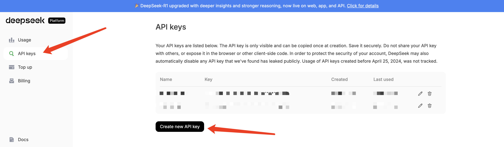

# spring-ai-chat-deepseek 

该工程模块主要是集成 DeepSeek 模型的聊天功能，提供了一个简单的接口来与 DeepSeek 进行对话。

* 基于 Advisor 机制实现 Token 统计
* PromptTemplate 多种编程范式使用

这里使用的不是 openai 协议来接入模型的，而是通过 deepseek 直接接入的方式，关于能否直接接入，可以从 spring ai 官方支持的 [模型列表](https://docs.spring.io/spring-ai/reference/api/chatmodel.html) 中获取。
对应的依赖是 `spring-ai-starter-model-deepseek`，如下：
```xml
<dependencies>
    <dependency>
        <groupId>org.springframework.ai</groupId>
        <artifactId>spring-ai-starter-model-deepseek</artifactId>
    </dependency>
</dependencies>
```

### 修改配置文件

在你启动项目之前，你需要修改 `application.properties` 文件，添加 DeepSeek 的 API 密钥。

```properties
# because we do not use the OpenAI protocol
spring.ai.deepseek.api-key=${spring.ai.deepseek.api-key}
spring.ai.deepseek.base-url=https://api.deepseek.com
spring.ai.deepseek.chat.completions-path=/v1/chat/completions
spring.ai.deepseek.chat.options.model=deepseek-chat
```
修改完成之后即可以在 IDEA 中启动项目，然后根据 controller 中提供的接口进行访问测试。

### 如何申请 DeepSeek API 密钥

* 1、打开 [deepseek 开放平台](https://platform.deepseek.com/api_keys)，按照下图剪头指示创建即可。


💰deepseek 的 API 是收费的，具体价格可以参考 [deepseek 的定价页面](https://api-docs.deepseek.com/quick_start/pricing/)。
不过相对来说比较便宜，建议充值了 10 元，足够测试使用。

