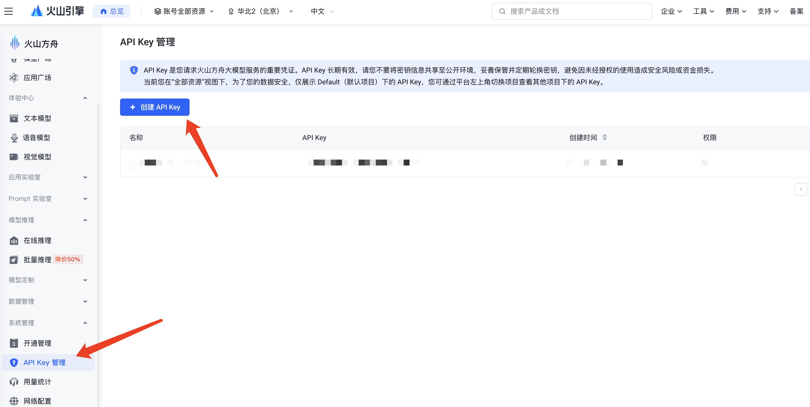

# spring-ai-chat-doubao 

该工程模块主要是集成 Doubao 模型的聊天功能，提供了一个简单的接口来与 Doubao 进行对话。

这里使用的是 openai 协议来接入模型的， 对应的依赖是 `spring-ai-starter-model-openai`，如下：
```xml
<dependencies>
    <dependency>
        <groupId>org.springframework.ai</groupId>
        <artifactId>spring-ai-starter-model-openai</artifactId>
    </dependency>
</dependencies>
```

配置文件部分也和 deepseek 有所区别，prefix 不同，具体参考 **修改配置文件** 部分。

### 修改配置文件

在你启动项目之前，你需要修改 `application.properties` 文件，添加 Doubao 的 API 密钥。

```properties
# use openai protocol model, but actually it is volcengine ark model
spring.ai.openai.api-key=${spring.ai.openai.api-key}
spring.ai.openai.chat.base-url=https://ark.cn-beijing.volces.com/api/v3
spring.ai.openai.chat.completions-path=/chat/completions
spring.ai.openai.chat.options.model=ep-20250117161524-4knd5
```
修改完成之后即可以在 IDEA 中启动项目，然后根据 controller 中提供的接口进行访问测试。

### 如何申请 Doubao API 密钥

* 1、打开 [火山方舟](https://console.volcengine.com/ark)，按照下图剪头指示创建即可。


💰有赠送的额度，如果只是测试 chat model，可以直接使用赠送的额度，不需要充值。如果需要使用它的 embedding 模型，建议少充值点。

