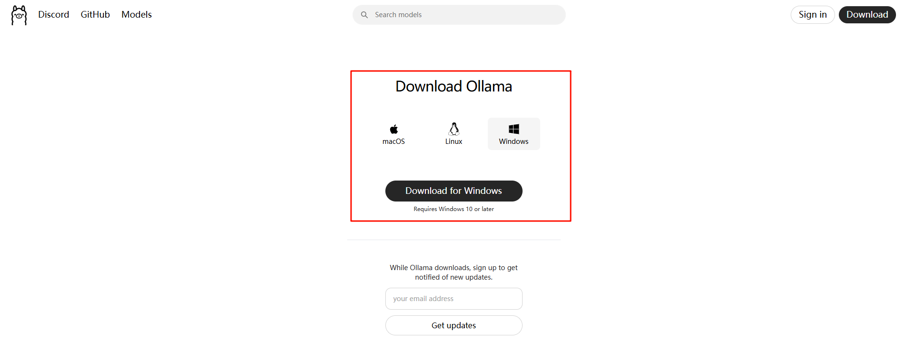
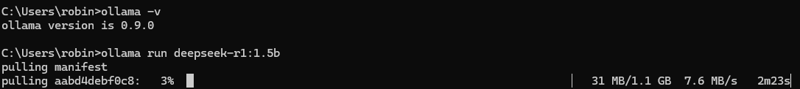
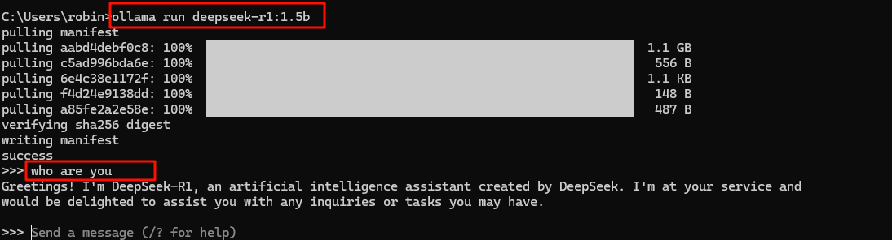

# spring-ai-chat-ollama

该工程模块主要是集成 Ollama 模型的聊天功能，提供了一个简单的接口来与 Ollama 进行对话。

Ollama 是一个专为在本地部署和运行大型语言模型的开源框架，支持多种开源模型如 qwen、deepseek、llama 等。

这里使用的是 Spring AI 的 Ollama 支持， 对应的依赖是 `spring-ai-starter-model-ollama`，如下：

```xml
<dependencies>
    <dependency>
        <groupId>org.springframework.ai</groupId>
        <artifactId>spring-ai-starter-model-ollama</artifactId>
    </dependency>
</dependencies>
```

## 前提条件

1. 下载并安装 Ollama： [Ollama](https://ollama.ai/download)

下载对应系统的ollama，然后像常规软件一样安装即可
2. 安装完成没有提示，随后在terminal输入 `ollama -v`，界面输出 ` ollama version is x.x.x `即表示安装完成；也可以通过 `ollama -h` 查看ollama 相关指令
3. 下载所需的模型，这里我们暂且部署一个参数量较少的模型先快速入手，例如 deepseek-r1:1.5b: `ollama run deepseek-r1:1.5b`，如果之前没有下载过该模型，ollama会从服务器下载

    > - Ollama 所支持的模型列表：[Models](https://ollama.com/search)
    > - Ollama会优先使用GPU加速（若环境支持），否则自动切换到CPU。所以即使你没有GPU环境，按照上面教程也可以部署一个能够使用的本地大模型，只是响应速度较慢
4. 等待完毕后，会自动进入terminal的chat聊天界面，在terminal的 >>> 后输入 `who are you`，看看大模型的回复。如有回复，则表示使用ollama部署 deepseek-r1:1.5b 模型就完成了



## 修改配置文件

在启动项目之前，需要确认 `application.properties` 文件中的配置是否符合你的 Ollama 环境。

```properties
spring.ai.ollama.base-url=http://localhost:11434
spring.ai.ollama.chat.model=deepseek-r1:1.5b
spring.ai.ollama.chat.options.temperature=0.7
```

主要的配置项说明：
- `spring.ai.ollama.base-url`: Ollama 服务的地址，默认为 http://localhost:11434
- `spring.ai.ollama.chat.model`: 使用的模型名称，就是之前在terminal中使用 ollama pull 或者 ollama run 下载的模型名字
- `spring.ai.ollama.chat.options.temperature`: 模型的温度参数，控制输出的随机性

修改完成之后即可以在 IDEA 中启动项目，然后根据 Controller 中提供的接口进行访问测试。 