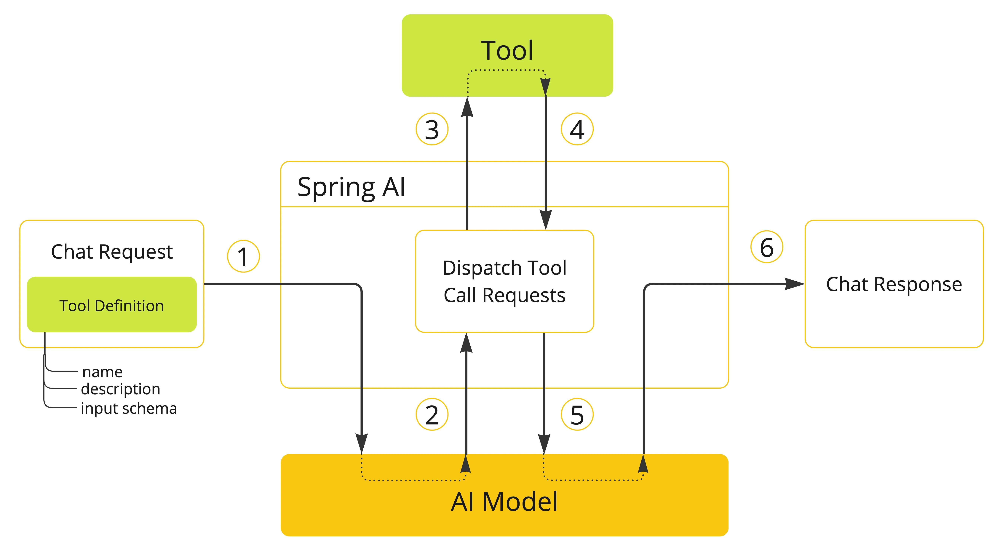
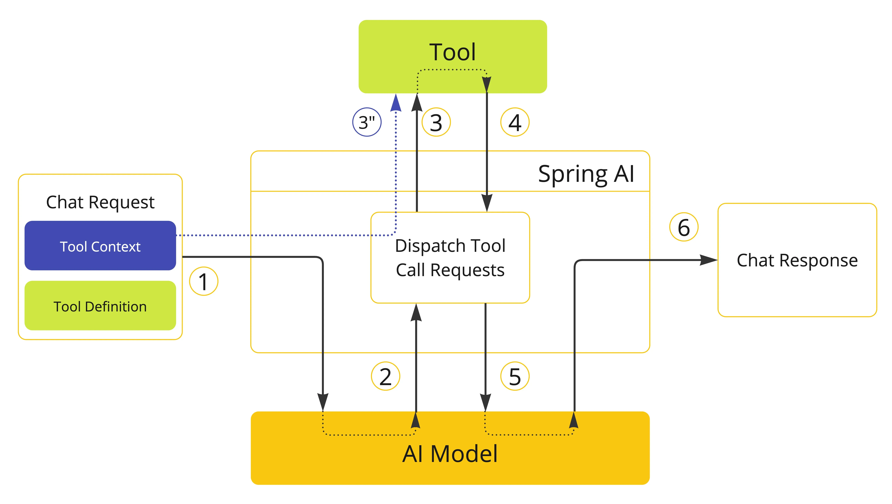
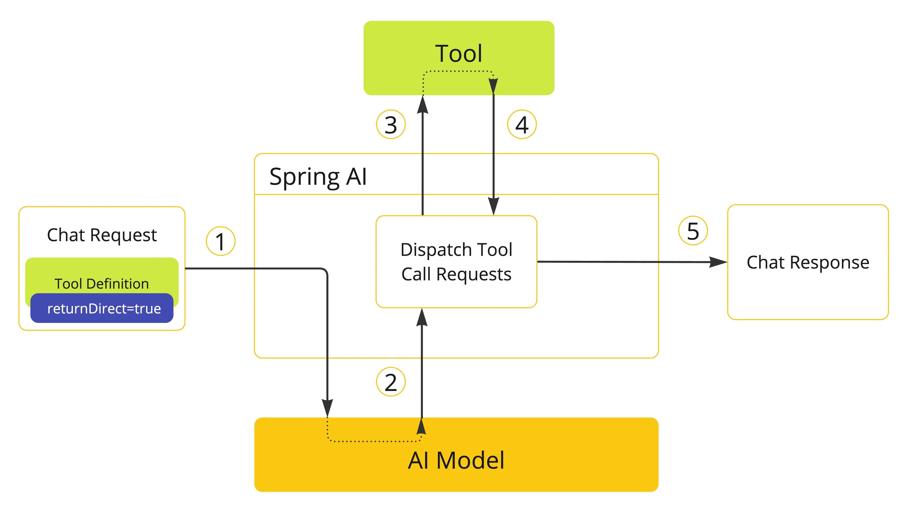
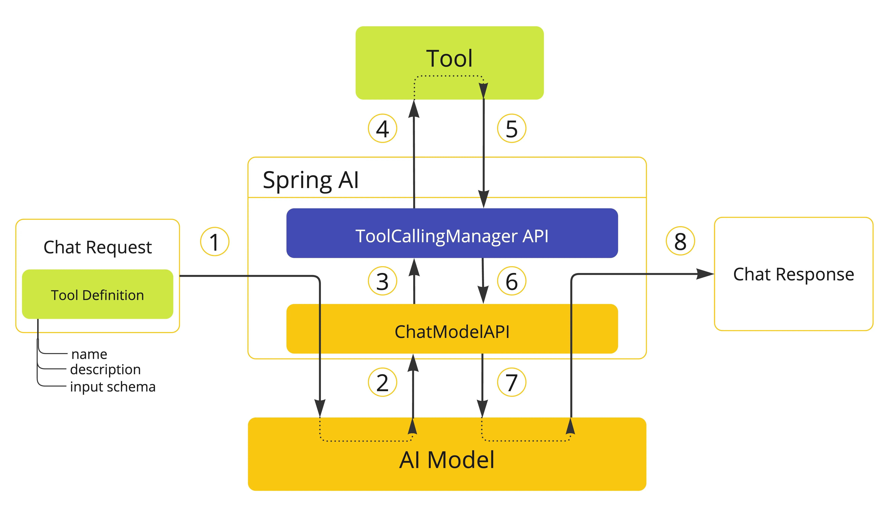

## Tool Calling

工具调用（也称为函数调用）是 AI 应用程序中的一种常见模式，允许模型与一组 API 或工具交互，从而扩展其功能。工具主要用于：

+ **信息检索。** 此类工具可用于从外部源（如数据库、Web 服务、文件系统或 Web 搜索引擎）检索信息。目标是增强模型的知识，使其能够回答原本无法回答的问题。因此，它们可用于检索增强生成（RAG）场景。例如，工具可用于检索给定位置的当前天气、检索最新新闻文章或查询数据库中的特定记录。
+ **执行操作。** 此类工具可用于在软件系统中执行操作，如发送电子邮件、在数据库中创建新记录、提交表单或触发工作流。目标是自动化原本需要人工干预或显式编程的任务。例如，工具可用于为与聊天机器人交互的客户预订航班、填写网页表单或在代码生成场景中基于自动化测试（TDD）实现 Java 类。

尽管我们通常将工具调用称为模型能力，但实际上是由客户端应用程序提供工具调用逻辑。模型只能请求工具调用并提供输入参数，而应用程序负责从输入参数执行工具调用并返回结果。模型永远无法访问作为工具提供的任何 API，这是一个关键的安全考虑因素。Spring AI 提供了便捷的 API 来定义工具、解析来自模型的工具调用请求并执行工具调用。本章主要概述 Spring AI 中的工具调用功能。

## 快速开始
首先看看如何在 Spring AI 中开始使用工具调用。这里我将实现两个简单的工具：一个用于信息检索，一个用于执行操作。信息检索工具将用于获取用户时区的当前日期和时间。操作工具将用于在指定时间设置闹钟。

### 信息检索
AI 模型无法访问实时信息。任何假设了解当前日期或天气预报等信息的问题都无法由模型回答。但是，我们可以提供一个可以检索这些信息的工具，让模型在需要访问实时信息时调用这个工具。

这里使用官方文档中提供的案例， `DateTimeTools` 类中实现一个工具来获取用户时区的当前日期和时间，这个工具不需要参数。Spring Framework 的 `LocaleContextHolder` 可以提供用户的时区。`DateTimeTools` 将使用 `@Tool` 注解进行声明。为了让模型能够理解是否以及何时调用此工具，可以在  @Tool 注解的 description 属性中给出工具功能的详细描述。

```java
import java.time.LocalDateTime;
import org.springframework.ai.tool.annotation.Tool;
import org.springframework.context.i18n.LocaleContextHolder;

public class DateTimeTools {

    @Tool(description = "Get the current date and time in the user's timezone")
    String getCurrentDateTime() {
        return LocalDateTime.now().atZone(LocaleContextHolder.getTimeZone().toZoneId()).toString();
    }

}
```

下面通过 ChatClient  的 `tools()` 方法来绑定 `DateTimeTools` 这个工具。当模型需要知道当前日期和时间时，它将请求调用工具。在内部，`ChatClient` 调用工具并将结果返回给模型，然后模型将使用工具调用结果生成对原始问题的最终响应。

```java
ChatModel chatModel = ...

String response = ChatClient.create(chatModel)
.prompt("What day is tomorrow?")
.defaultTools(new DateTimeTools())
.call()
.content();

System.out.println(response);
```

输出将类似于：

```plain
Tomorrow is 2025-5-29.
```

再次尝试问同样的问题。这次，不要向模型提供工具。输出将类似于：

```plain
I am an AI and do not have access to real-time information. Please provide the current date so I can accurately determine what day tomorrow will be.
```

没有工具，模型不知道如何回答这个问题，因为它无法确定当前日期和时间。

### 执行操作
AI 模型可用于生成实现某些目标的计划。例如，模型可以生成预订丹麦之旅的计划。但是，模型没有执行计划的能力。这就是工具的用武之地：它们可用于执行模型生成的计划。

在前面的示例中，我们使用工具来确定当前日期和时间。在此示例中，我们将定义第二个工具用于在特定时间设置闹钟。目标是设置从现在起 10 分钟的闹钟，因此我们需要向模型提供两个工具来完成此任务。

我们将新工具添加到与之前相同的 `DateTimeTools` 类中。新工具将接受一个参数，即 ISO-8601 格式的时间。然后，工具将在控制台打印一条消息，指示已为给定时间设置闹钟。与之前一样，该工具使用 `@Tool` 注解定义，我们还用它提供详细描述以帮助模型理解何时以及如何使用该工具。

```java
import java.time.LocalDateTime;
import java.time.format.DateTimeFormatter;
import org.springframework.ai.tool.annotation.Tool;
import org.springframework.context.i18n.LocaleContextHolder;

class DateTimeTools {

    @Tool(description = "Get the current date and time in the user's timezone")
    String getCurrentDateTime() {
        return LocalDateTime.now().atZone(LocaleContextHolder.getTimeZone().toZoneId()).toString();
    }

    @Tool(description = "Set a user alarm for the given time, provided in ISO-8601 format")
    void setAlarm(String time) {
        LocalDateTime alarmTime = LocalDateTime.parse(time, DateTimeFormatter.ISO_DATE_TIME);
        System.out.println("Alarm set for " + alarmTime);
    }

}
```

接下来，让我们使两个工具对模型可用。我们将使用 `ChatClient` 与模型交互。我们将通过 `tools()` 方法传递 `DateTimeTools` 的实例来向模型提供工具。当我们要求从现在起 10 分钟设置闹钟时，模型首先需要知道当前日期和时间。然后，它将使用当前日期和时间来计算闹钟时间。最后，它将使用闹钟工具设置闹钟。在内部，`ChatClient` 将处理来自模型的任何工具调用请求并将任何工具调用执行结果发送回模型，以便模型可以生成最终响应。

```java
@Bean
public ChatClient chatClient(OpenAiChatModel chatModel, ChatMemory chatMemory) {

//        ToolCallback[] toolCallbacks = ToolCallbacks.from(new DateTimeTools(),new FileReaderTools());
//        ChatClient.builder(chatModel)
//                .defaultToolCallbacks(toolCallbacks)
//                .defaultAdvisors(MessageChatMemoryAdvisor.builder(chatMemory).build())
//                .defaultSystem("You are deepseek chat bot, you answer questions in a concise and accurate manner.")
//                .build();

    // 与上面的代码等价
    return ChatClient.builder(chatModel)
    .defaultTools(new DateTimeTools(), new FileReaderTools())
    .defaultAdvisors(MessageChatMemoryAdvisor.builder(chatMemory).build())
    .defaultSystem("You are deepseek chat bot, you answer questions in a concise and accurate manner.")
    .build();
}
```

在应用程序日志中，你可以检查闹钟是否已在正确的时间设置。

## 概述
Spring AI 提供了一套灵活的抽象机制，用于支持工具调用（tool calling），开发者可以通过这些机制以统一的方式来定义、解析并执行各类工具。本节将介绍 Spring AI 中工具调用的核心概念和主要组件。



1、如果我们希望某个工具可以被模型使用，就需要在对话请求中定义该工具，包括工具的名称、功能描述和输入参数的结构说明（schema）。

2、一旦模型决定调用某个工具，它会返回一条响应，包含工具的名称以及根据 schema 构造的输入参数。

3、应用程序需要根据工具名称找到并执行对应的工具，同时传入模型提供的参数。

4、工具的执行结果由应用程序处理。

5、然后应用程序将处理结果返回给模型。

6、模型会将工具调用的结果作为额外的上下文信息，生成最终的回复。


工具是工具调用机制中的核心组件，它们通过 `ToolCallback` 接口进行建模。Spring AI 提供了内建支持，可以将方法或函数直接注册为 `ToolCallback`，当然你也可以自己实现该接口，以适配更复杂的业务需求。

在实际使用中，`ChatModel` 会自动将模型发起的工具调用请求转发给相应的 `ToolCallback` 实例，并在获取结果后将其反馈给模型，由模型生成最终的回复。这一过程由 `ToolCallingManager` 接口协调完成，它负责工具调用的整个执行流程。

无论是 `ChatClient` 还是 `ChatModel`，都支持通过传入一组 `ToolCallback` 实例将工具注册给模型，并结合 `ToolCallingManager` 执行这些工具。

除了直接传入 `ToolCallback` 对象之外，还可以只传入工具的名称列表，工具会通过 `ToolCallbackResolver` 接口动态解析成具体的执行逻辑。


## Methods 作为 Tools
Spring AI 内置支持通过 Methods 指定工具，可以通过两种方式实现：

+ 在方法上声明 `@Tool 注解`
+ 通过编码方式实现 `MethodToolCallback`

###  @Tool 注解
```java
@Tool(description = "Get the current date and time in the user's timezone")
public String getCurrentDateTime() {
    return LocalDateTime.now().atZone(LocaleContextHolder.getTimeZone().toZoneId()).toString();
}
```

`@Tool` 注解中几个关键方法：

+ **name**：工具名称。如果未指定，将使用方法名。AI 模型在调用工具时会使用此名称。因此，在同一个类中不允许有两个名称相同的工具。对于特定聊天请求中可用的所有工具，其名称必须唯一。
+ **description**：工具的描述，供模型理解何时以及如何调用该工具。如果未指定，将使用方法名作为工具描述。但强烈建议提供详细的描述，因为这是模型理解工具用途及其使用方式的关键。如果描述不清晰，可能导致模型在该使用工具时不调用它，或调用方式不正确。
+ **returnDirect**：是否将工具结果直接返回给客户端，还是将其传回给模型。
+ **resultConverter**：用于将工具调用结果转换为 `String` 对象，以便返回给 AI 模型的 `ToolCallResultConverter` 实现类。

Spring AI 会自动为带有 `@Tool` 注解的方法生成输入参数的 JSON Schema。这个 Schema 是模型识别工具使用方式的关键，它能帮助模型构造正确的调用请求。我们可以通过 `@ToolParam` 注解为每个参数补充更多信息，比如添加说明文字、标明该参数是否为必填项等。默认情况下，所有参数都被视为必填。

```java
import java.time.LocalDateTime;
import java.time.format.DateTimeFormatter;
import org.springframework.ai.tool.annotation.Tool;
import org.springframework.ai.tool.annotation.ToolParam;

public class DateTimeTools {

    @Tool(description = "Set a user alarm for the given time")
    public void setAlarm(@ToolParam(description = "Time in ISO-8601 format") String time) {
        LocalDateTime alarmTime = LocalDateTime.parse(time, DateTimeFormatter.ISO_DATE_TIME);
        System.out.println("Alarm set for " + alarmTime);
    }

}
```

@ToolParam 注解允许我们为工具参数提供更多描述信息：

+ description：参数的描述，帮助模型更好地理解如何使用该参数，比如参数应采用什么格式，允许哪些取值等。
+ required：参数是否必填，默认情况下所有参数都被视为必填。

如果参数被标注为 @Nullable，则会被视为可选，除非通过 @ToolParam 注解显式声明为必填。除了 @ToolParam 注解外，我们还可以使用 Swagger 的 @Schema 注解或 Jackson 的 @JsonProperty 注解。

### `MethodToolCallback`

MethodToolCallback.Builder 允许我们构建一个 MethodToolCallback 实例，并提供工具的关键信息：

+ toolDefinition：定义工具名称、描述和输入参数结构的 ToolDefinition 实例。可以通过 ToolDefinition.Builder 类构建，必填项。
+ toolMetadata：定义额外设置的 ToolMetadata 实例，比如结果是否直接返回给客户端，以及使用的结果转换器。可以通过 ToolMetadata.Builder 构建。
+ toolMethod：表示工具方法的 Method 实例，必填项。
+ toolObject：包含工具方法的对象实例。
+ toolCallResultConverter：用于将工具调用结果转换为发送给 AI 模型的字符串的 ToolCallResultConverter 实例。如果不提供，则使用默认转换器 DefaultToolCallResultConverter。

ToolDefinition.Builder 允许我们构建 ToolDefinition 实例，并定义工具的名称、描述和输入参数结构：

+ name：工具名称。如果未提供，则使用方法名。AI 模型通过此名称识别调用的工具，因此同一个类中不允许存在同名工具。该名称在特定聊天请求中所有可用工具中必须唯一。
+ description：工具描述，帮助模型理解何时以及如何调用该工具。如果未提供，则使用方法名作为描述。但强烈建议提供详细描述，因为这对模型理解工具用途及使用方式至关重要。缺乏良好描述可能导致模型未能在应调用时使用工具，或错误调用工具。
+ inputSchema：工具输入参数的 JSON 结构。如果未提供，系统将基于方法参数自动生成。可通过 @ToolParam 注解提供输入参数的附加信息，如描述及是否必填，默认所有参数均视为必填。

ToolMetadata.Builder 允许我们构建 ToolMetadata 实例，并定义工具的附加设置：

+ returnDirect：是否将工具结果直接返回给客户端，还是传回模型。

```java
Method method = ReflectionUtils.findMethod(DateTimeTools.class, "getCurrentDateTime");
ToolCallback toolCallback = MethodToolCallback.builder()
        .toolDefinition(ToolDefinition.builder().name("getCurrentDateTime")
                .description("Get the current date and time in the user's timezone")
                .build())
        .toolMethod(method)
        .build();
ChatClient chatClient = ChatClient.builder(chatModel)
        .defaultToolCallbacks(toolCallback)
        .defaultAdvisors(MessageChatMemoryAdvisor.builder(chatMemory).build())
        .defaultSystem("You are deepseek chat bot, you answer questions in a concise and accurate manner.")
        .build();
```

### MethodTool 的限制
以下类型目前不支持用作工具方法的参数或返回值：

1. `Optional`
2. 异步类型（如 `CompletableFuture`、`Future`）
3. 响应式类型（如 `Flow`、`Mono`、`Flux`）
4. 函数式类型（如 `Function`、`Supplier`、`Consumer`）


函数式类型可以通过 Functions as Tools 方式使用。

## Function 作为 Tools
Spring AI 内置支持通过 Function 指定工具，可以通过两种方式实现：

+ 使用底层的 `FunctionToolCallback` 实现，以编程方式定义工具；
+ 也可以将函数作为 `@Bean` 动态注册，在运行时解析并使用。

### `FunctionToolCallback`
可以通过编程方式构建 `FunctionToolCallback`，将函数式类型（如 `Function`、`Supplier`、`Consumer` 或 `BiFunction`）转换为工具。

```java
public class WeatherService implements Function<WeatherRequest, WeatherResponse> {
    public WeatherResponse apply(WeatherRequest request) {
        return new WeatherResponse(30.0, Unit.C);
    }
}

public enum Unit { C, F }
public record WeatherRequest(String location, Unit unit) {}
public record WeatherResponse(double temp, Unit unit) {}
```

可以通过 `FunctionToolCallback.Builder` 构建一个 `FunctionToolCallback` 实例，并为工具提供关键信息，包括：

+ **name**：工具名称。模型依靠该名称识别并调用工具，因此同一上下文中不允许存在两个重名工具。该名称在一次对话请求中必须全局唯一（**必填**）。
+ **toolFunction**：表示工具方法的函数式对象，支持 `Function`、`Supplier`、`Consumer` 和 `BiFunction` 类型（**必填**）。
+ **description**：工具的描述，用于帮助模型理解该工具的用途以及何时、如何调用。如果未显式提供，则默认使用方法名作为描述。但强烈建议提供详细描述，因为这对模型理解工具的作用和用法至关重要。描述不足可能导致模型在该使用工具时未调用，或使用方式错误。
+ **inputType**：函数输入参数的类型（**必填**）。
+ **inputSchema**：工具输入参数的 JSON Schema。若未指定，会根据 `inputType` 自动生成。可使用 `@ToolParam` 注解补充参数的描述信息，如是否必填等。默认所有参数均为必填项。详见 JSON Schema 章节。
+ **toolMetadata**：定义工具额外设置的对象，包括是否将结果直接返回给客户端、使用哪个结果转换器等。可通过 `ToolMetadata.Builder` 构建。
+ **toolCallResultConverter**：用于将工具调用结果转换为字符串的 `ToolCallResultConverter` 实例，供模型接收。如果未提供，则使用默认转换器 `DefaultToolCallResultConverter`。

可以使用 `ToolMetadata.Builder` 构建一个 `ToolMetadata` 实例，并定义该工具的附加配置项，包括：

+ **returnDirect**：是否将工具执行结果直接返回给客户端，而不是交由模型进一步处理。

```java
// 使用 FunctionToolCallback.Builder 构建 ToolCallback 实例
ToolCallback toolCallback = FunctionToolCallback
                .builder("currentWeather", new WeatherService())
                .description("Get the weather in location")
                .inputType(WeatherRequest.class)
                .build();

// 与上面的代码等价
return ChatClient.builder(chatModel)
    .defaultTools(new DateTimeTools(), new FileReaderTools())
    // defaultToolCallbacks
    .defaultToolCallbacks(toolCallback)
    .defaultAdvisors(MessageChatMemoryAdvisor.builder(chatMemory).build())
    .defaultSystem("You are deepseek chat bot, you answer questions in a concise and accurate manner.")
    .build();
```

### 使用动态注册方式
除了通过编程方式指定工具外，也可以将工具定义为 Spring Bean，并通过 Spring AI 提供的 `ToolCallbackResolver` 接口（具体实现为 `SpringBeanToolCallbackResolver`）在运行时动态解析。这种方式允许将任何 `Function`、`Supplier`、`Consumer` 或 `BiFunction` 类型的 Bean 当作工具使用。

在这种模式下，**Bean 的名称会作为工具的名称**，而 Spring Framework 中的 `@Description` 注解则可用于为工具提供描述，供模型参考，以判断何时以及如何调用该工具。如果未显式提供描述，则默认使用方法名作为工具描述。**强烈建议提供详细且准确的描述**，否则可能导致模型在应使用工具时未调用，或调用方式不正确。

```java
@Configuration(proxyBeanMethods = false)
public class WeatherTools {

    WeatherService weatherService = new WeatherService();

	@Bean
	@Description("Get the weather in location")
	Function<WeatherRequest, WeatherResponse> currentWeather() {
		return weatherService;
	}

}
```

### Function Tool 限制


以下类型目前**不支持**作为函数式工具（Function、Supplier 等）中使用的输入或输出类型：

+ 基本类型（Primitive types）
+ `Optional` 类型
+ 集合类型（例如 `List`、`Map`、`Array`、`Set`）
+ 异步类型（例如 `CompletableFuture`、`Future`）
+ 响应式类型（例如 `Flow`、`Mono`、`Flux`）

如需使用基本类型或集合类型，建议改用 Method-Tool 来定义工具。

## Tool Specification
在 Spring AI 中，工具通过 ToolCallback 接口进行建模。前面章节中，我们了解了如何利用 Spring AI 提供的内置支持，从方法和函数定义工具（参见“methods as tool”和“function as tool”）。本节将更深入地探讨工具规范，以及如何进行定制和扩展，以支持更多使用场景。

### Tool Callback
ToolCallback 接口提供了一种定义可被 AI 模型调用的工具的方法，包含工具的定义和执行逻辑。当需要从零开始定义一个工具时，这是主要需要实现的接口。例如，可以基于 MCP Client（使用模型上下文协议）或 ChatClient 来定义一个 ToolCallback，用于构建模块化的智能代理应用。<font style="color:rgb(111, 66, 193);background-color:rgb(246, 248, 250);">ToolCallback 接口定义如下：</font>

```java
public interface ToolCallback {

	/**
	 * 定义由 AI 模型用来判断何时以及如何调用该工具。
	 */
	ToolDefinition getToolDefinition();

	/**
	 * 元数据，提供有关如何处理该工具的额外信息。
	 */
	ToolMetadata getToolMetadata();

    /**
	 * 使用给定的输入执行工具，并返回结果以发送回 AI 模型。
	 */
	String call(String toolInput);

    /**
	 * 使用给定的输入和上下文执行工具，并返回结果以发送回 AI 模型。
	 */
	String call(String toolInput, ToolContext tooContext);

}
```

Spring AI 提供了工具方法（MethodToolCallback）和工具函数（FunctionToolCallback）的内置实现。

### Tool ToolDefinition
ToolDefinition 接口提供了 AI 模型了解工具可用性所需的信息，包括工具名称、描述和输入参数的模式。每个 ToolCallback 实现都必须提供一个 ToolDefinition 实例来定义该工具。ToolDefinition 接口定义如下：

```java
public interface ToolDefinition {

	/**
	 * 工具名称：在提供给模型的工具集中必须唯一。
	 */
	String name();

	/**
	 * 工具的描述信息
	 */
	String description();

	/**
	 * 用于调用该工具的参数的 Schema（模式定义）。
     * 关于 json schema 可以参考：https://docs.spring.io/spring-ai/reference/api/tools.html#_json_schema
	 */
	String inputSchema();

}
```
ToolDefinition.Builder 允许我们使用默认实现类 DefaultToolDefinition 来构建一个 ToolDefinition 实例。

```java
ToolDefinition toolDefinition = ToolDefinition.builder()
    .name("currentWeather")
    .description("Get the weather in location")
    .inputSchema("""
        {
            "type": "object",
            "properties": {
                "location": {
                    "type": "string"
                },
                "unit": {
                    "type": "string",
                    "enum": ["C", "F"]
                }
            },
            "required": ["location", "unit"]
        }
    """)
    .build();
```

#### Method Tool Definition
下面示例是构建 `Method ToolDefinition` 的方式

```java
Method method = ReflectionUtils.findMethod(DateTimeTools.class, "getCurrentDateTime");
ToolDefinition toolDefinition = ToolDefinition.builder(method)
    .name("currentDateTime")
    .description("Get the current date and time in the user's timezone")
    .inputSchema(JsonSchemaGenerator.generateForMethodInput(method))
    .build();
```

#### Function Tool Definition
从函数构建工具时，`ToolDefinition` 会自动为我们生成。使用 `FunctionToolCallback.Builder` 构建 `FunctionToolCallback` 实例时，可以提供工具名称、描述和输入 schema，这些信息将用于生成 ToolDefinition。

### Tool Context
Spring AI 支持通过 `ToolContext API` 向工具传递额外的上下文信息。该功能允许我们提供额外的用户数据，这些数据可以与 AI 模型传递的工具参数一起在工具执行过程中使用。



```java
 @Tool(description = "Get the current date and time in the user's timezone")
public String getFormatDateTime(ToolContext toolContext) {
    return new SimpleDateFormat(toolContext.getContext().get("format").toString())
            .format(LocalDateTime.now().atZone(LocaleContextHolder.getTimeZone().toZoneId()).toInstant().toEpochMilli());
}
```

具体使用如下：

```java
ChatClient.create(chatModel)
        .prompt("Tell me more about the customer with ID 42")
        .tools(new DateTimeTools())
        .toolContext(Map.of("format", "yyyy-MM-dd HH:mm:ss"))
        .call()
        .content();
```


### Return Direct
默认情况下，工具调用的结果会作为响应发送回模型，模型随后可以利用该结果继续对话。但在某些情况下，我们希望直接将结果返回给调用方，而不是发送回模型。比如，当构建一个依赖 RAG 工具的智能体时，可能想直接将结果返回给调用者，避免模型进行不必要的后续处理。又或者，有些工具应当结束智能体的推理循环。每个 ToolCallback 实现都可以定义工具调用结果是直接返回给调用方，还是发送回模型。默认行为是将结果发送回模型，但我们可以针对每个工具调整这个行为。负责管理工具执行生命周期的 ToolCallingManager 会处理工具的 returnDirect 属性。如果该属性为 true，工具调用结果会直接返回给调用方；否则，结果将发送回模型。

> PS : 如果同时请求多个工具调用，必须将所有工具的 returnDirect 属性都设置为 true，结果才能直接返回给调用方。否则，结果将会发送回模型。




* 1、当我们希望让模型能够调用某个工具时，会在聊天请求中包含该工具的定义。如果希望工具执行结果直接返回给调用方，需要将 returnDirect 属性设置为 true。
* 2、当模型决定调用工具时，会发送包含工具名称和按照定义的参数 schema 组织的输入参数的响应。
* 3、应用程序负责根据工具名称识别并使用提供的输入参数执行该工具。
* 4、应用程序处理工具调用的结果。
* 5、应用程序将工具调用结果直接发送给调用方，而不是返回给模型。

## Tool Execution

工具执行是指使用提供的输入参数调用工具并返回结果的过程。工具执行由 ToolCallingManager 接口负责管理，该接口负责整个工具执行的生命周期。

```java
public interface ToolCallingManager {

	/**
	 * 从模型的工具调用选项中解析工具定义。
	 */
	List<ToolDefinition> resolveToolDefinitions(ToolCallingChatOptions chatOptions);

	/**
	 * 执行模型请求的工具调用。
	 */
	ToolExecutionResult executeToolCalls(Prompt prompt, ChatResponse chatResponse);
}
```

如果使用了任何 Spring AI Spring Boot Starter，DefaultToolCallingManager 是 ToolCallingManager 接口的自动配置实现。我们可以通过提供自定义的 ToolCallingManager Bean 来定制工具执行行为。

```java
@Bean
ToolCallingManager toolCallingManager() {
    return ToolCallingManager.builder().build();
}
```

默认情况下，Spring AI 会在每个 ChatModel 实现内部为你透明地管理工具执行生命周期。但是也可以选择不使用这种默认行为，而是自行控制工具的执行。 下面将介绍这两种场景。

### 由框架控制的 Tool Execution
在使用默认行为时，Spring AI 会自动拦截模型发起的任何 Tool Calling 请求，执行对应工具并将结果返回给模型。所有这些操作都由各个 `ChatModel` 实现通过 `ToolCallingManager` 透明完成，无需额外配置或手动干预。



* 1、在我们希望让某个工具对模型可用时，需要在聊天请求（Prompt）中包含该工具的定义，并通过 ChatModel API 向 AI 模型发送请求。
* 2、当模型决定调用某个工具时，会发回一个响应（ChatResponse），其中包含工具名称和根据预定义 schema 构造的输入参数。
* 3、ChatModel 将工具调用请求发送给 ToolCallingManager API。
* 4、ToolCallingManager 负责识别应调用的工具，并使用提供的输入参数执行该工具。
* 5、工具调用结果返回给 ToolCallingManager。
* 6、ToolCallingManager 将工具执行结果返回给 ChatModel。
* 7、ChatModel 将工具执行结果作为 ToolResponseMessage 发送回 AI 模型。
* 8、AI 模型结合工具调用结果生成最终响应，并通过 ChatClient 将 ChatResponse 返回给调用方。

> 当前，与模型之间就工具执行所交换的内部消息对用户来说是不可见的。如果需要访问这些消息，必须采用用户控制的工具执行方式。

Tool Calling 是否可以执行的判断逻辑由 `ToolExecutionEligibilityPredicate` 接口负责控制。通常情况下，工具执行的条件是 ToolCallingChatOptions 的 internalToolExecutionEnabled 属性被设置为 true（默认值），并且 ChatResponse 中包含工具调用信息。

```java
/**
 * Default implementation of {@link ToolExecutionEligibilityPredicate} that checks whether
 * tool execution is enabled in the prompt options and if the chat response contains tool
 * calls.
 *
 * @author Christian Tzolov
 */
public class DefaultToolExecutionEligibilityPredicate implements ToolExecutionEligibilityPredicate {

	@Override
	public boolean test(ChatOptions promptOptions, ChatResponse chatResponse) {
		return ToolCallingChatOptions.isInternalToolExecutionEnabled(promptOptions) && chatResponse != null
				&& chatResponse.hasToolCalls();
	}

}
```

当然，我们也可以在实际开发过程中自己实现这个接口，只要在创建 `ChatModel` Bean 时，指定自定义的 `ToolExecutionEligibilityPredicate` 实现，从而实现自定义控制是否可被调用的判断逻辑。

### 由用户控制的  Tool Execution

在某些场景下，我们其实更希望自行控制工具的执行生命周期。Spring AI 中提供了这样的扩展能力。即将 `ToolCallingChatOptions` 的 `internalToolExecutionEnabled` 属性设置为 `false`。当基于这个选项调用 `ChatModel` 时，工具的执行将由调用方负责，从而实现对整个执行流程的完全控制。不过我们需要自行在 `ChatResponse` 中检查是否存在工具调用，并通过 `ToolCallingManager` 执行这些调用。

下面是个示例

```java
public String manualExecTools(String message) {
    // 创建一个 ToolCallingManager 实例
    ToolCallingManager toolCallingManager = ToolCallingManager.builder().build();
    // 注册工具方法
    ToolCallback[] toolCallbacks = ToolCallbacks.from(new DateTimeTools());
    // 创建一个 ChatOptions 实例，包含工具调用选项
    ChatOptions chatOptions = ToolCallingChatOptions.builder()
            .toolCallbacks(toolCallbacks)
            .internalToolExecutionEnabled(false)
            .build();
    // 创建一个 Prompt 实例，包含用户消息和工具调用选项
    Prompt prompt = new Prompt(message, chatOptions);
    // 调用 ChatModel 进行对话
    ChatResponse chatResponse = chatModel.call(prompt);
    // 如果 ChatResponse 包含工具调用，则执行工具调用
    while (chatResponse.hasToolCalls()) {
        // 执行工具调用
        ToolExecutionResult toolExecutionResult = toolCallingManager.executeToolCalls(prompt, chatResponse);
        // 更新 Prompt 实例，包含工具执行结果和工具调用选项
        prompt = new Prompt(toolExecutionResult.conversationHistory(), chatOptions);
        // 再次调用 ChatModel 进行对话
        chatResponse = chatModel.call(prompt);
    }
    // 获取最终的回答
    String answer = chatResponse.getResult().getOutput().getText();
    System.out.println(answer);
    return answer;
}
```

> 在选择用户控制的工具执行方式时，推荐使用 `ToolCallingManager` 来管理工具调用操作。这样可以充分利用 Spring AI 提供的内置支持来完成工具的执行流程。当然，你也可以自行实现工具的执行逻辑，Spring AI 并不会对此做什么限制。

[这个示例](https://github.com/glmapper/spring-ai-summary/blob/main/spring-ai-tool-calling/src/main/java/com/glmapper/ai/tc/memory/UserControlledMemory.java)展示了将用户控制的工具执行方式与 ChatMemory API 结合使用的实现。

### 异常处理

当工具调用失败时，会抛出一个 `ToolExecutionException` 异常，可通过捕获该异常来处理错误。可以使用 `ToolExecutionExceptionProcessor` 来处理 `ToolExecutionException`，处理结果有两种：要么生成一条错误信息返回给 AI 模型，要么抛出异常由调用方处理。

```java
@FunctionalInterface
public interface ToolExecutionExceptionProcessor {

	/**
	 * Convert an exception thrown by a tool to a String that can be sent back to the AI
	 * model or throw an exception to be handled by the caller.
	 */
	String process(ToolExecutionException exception);

}
```

只要我们引入了 Spring AI  相关的 start 依赖，就会引入`ToolExecutionExceptionProcessor` 接口的自动配置实现。默认情况下，错误信息会被发送回模型。`DefaultToolExecutionExceptionProcessor` 构造函数允许设置 `alwaysThrow` 属性为 `true` 或 `false`。如果设为 `true`，则会抛出异常，而不是将错误信息返回给模型。

> 如果自定义了自己的 `ToolCallback` 实现，务必在 `call()` 方法中的工具执行逻辑出现错误时抛出 `ToolExecutionException`。

ToolCallingManager 在工具执行过程中处理异常就是 ToolExecutionExceptionProcessor 的实现。

## Tool  Resolution
将工具传递给模型的主要方式，是在调用 `ChatClient` 或 `ChatModel` 时，提供一个或多个 `ToolCallback`，前面我已经做过相关介绍。除了这两种方式外，Spring AI 还支持通过 `ToolCallbackResolver` 接口在运行时动态解析工具。

```java
public interface ToolCallbackResolver {

	/**
	 * Resolve the {@link ToolCallback} for the given tool name.
	 */
	@Nullable
	ToolCallback resolve(String toolName);

}
```

当我们使用这种方式时：

+ 在客户端，需要向 `ChatClient` 或 `ChatModel` 提供工具名称，而不是 `ToolCallback` 实例。
+ 在服务端，由 `ToolCallbackResolver` 接口的实现类负责将工具名称解析为对应的 `ToolCallback` 实例。

Spring AI  中 ToolCallbackResolver 接口的默认实现是`DelegatingToolCallbackResolver`，其本质是将工具解析的任务委托给一组 `ToolCallbackResolver` 实例。

+ `SpringBeanToolCallbackResolver` 会从 Spring 容器中的 `Function`、`Supplier`、`Consumer` 或 `BiFunction` 类型的 Bean 中解析工具。
+ `StaticToolCallbackResolver` 会从一组静态的 `ToolCallback` 实例中解析工具。在使用 Spring Boot 自动配置时，该解析器会自动加载应用上下文中定义的所有 `ToolCallback` 类型的 Bean。


如果依赖 Spring Boot 自动配置，可以通过提供自定义的 `ToolCallbackResolver` Bean 来定制工具解析逻辑。代码如下：

```java
@Bean
ToolCallbackResolver toolCallbackResolver(List<FunctionCallback> toolCallbacks) {
    StaticToolCallbackResolver staticToolCallbackResolver = new StaticToolCallbackResolver(toolCallbacks);
    return new DelegatingToolCallbackResolver(List.of(staticToolCallbackResolver));
}
```

`ToolCallbackResolver` 在运行时被 `ToolCallingManager` 使用，用于动态解析工具，同时支持框架控制的工具执行方式和用户控制的工具执行方式。

